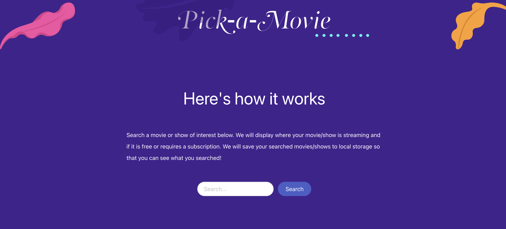

# Find-a-movie

## Description

Search a movie or show of interest. We will display where your movie/show is streaming and if it is free or requires a subscription. We will save your searched movies/shows to local storage so that you can see what you searched!

## Usage

deployed link: https://jeffch19.github.io/Find-a-movie/ 

## Project Credits

* Courtney Kalbach - https://github.com/knc2007
* Lisa Lar - https://github.com/ayoleese
* Bogdan Tkachuk - https://github.com/aldu1n
* Jeffrey Cummings -  https://github.com/jeffch19 

## Technologies Used
* HTML
* Standard CSS with Bulma as well
* Javascript
* JQuery
* Third Party-APIs

## License

Please refer to the license in the repo.

